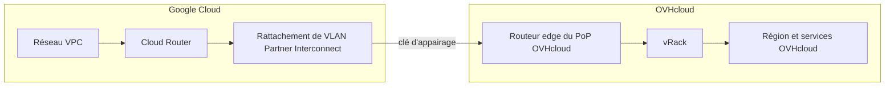

import Api from '@components/Api';

## Objectif

OVHcloud Connect Cross Cloud avec GCP établit une connexion privée de niveau 3 entre votre réseau Google Cloud et votre vRack OVHcloud, via Google Cloud Partner Interconnect. Le trafic circule sur un lien dédié plutôt que sur l'Internet public. Contrairement aux connexions avec les autres providers, la clé de service (appelée **clé d'appairage**, ou *pairing key*, dans la terminologie Google Cloud) est générée dans la console Google Cloud, puis transmise à OVHcloud via l'API pour provisionner la connexion.

**Dans ce guide, vous allez apprendre à :**

- Créer un rattachement de VLAN Partner Interconnect et générer une clé d'appairage dans Google Cloud.
- Commander le service OVHcloud Connect pour une connexion Google.
- Transmettre la clé d'appairage à OVHcloud afin que la connexion soit provisionnée.
- Vérifier le circuit, la configuration du point de présence (PoP) et la session BGP obtenus à l'issue du provisionnement.

## Prérequis

- Un vRack OVHcloud
- Un projet Google Cloud disposant d'un réseau VPC et d'un Cloud Router, dans une région accessible depuis le PoP OVHcloud que vous visez
- Un accès à votre <ManagerLink to="/">espace client OVHcloud</ManagerLink>
- Un accès à la [console Google Cloud](https://console.cloud.google.com/)
- Un accès aux <ApiLink>API OVHcloud</ApiLink>, avec des credentials créés en suivant le guide [Premiers pas avec les API OVHcloud](/guides/manage-and-operate/api/first-steps)

## Introduction

OVHcloud Connect Cross Cloud avec GCP est une connexion OVHcloud Connect de type provider reposant sur **Google Cloud Partner Interconnect**. Côté Google, la connexion est un rattachement de VLAN sur un Cloud Interconnect ; côté OVHcloud, elle se présente sous la forme d'un circuit dans votre vRack.

Deux caractéristiques la distinguent d'une connexion OVHcloud Connect Provider standard :

- Sa clé de service est une **clé d'appairage** générée dans Google Cloud. OVHcloud n'émet ni n'envoie par e-mail de clé de service pour une connexion Google.
- Il s'agit toujours d'un service de **niveau 3 (BGP)**. La couche 2 n'est pas prise en charge, et la configuration du PoP est créée automatiquement lorsqu'OVHcloud consomme la clé d'appairage : vous n'avez pas à l'ajouter ni à la supprimer manuellement.

## En pratique

**Sommaire :**

- [Fonctionnement](#how-it-works)
- [Étape 1 - Créer le rattachement de VLAN et la clé d'appairage dans Google Cloud](#step-1)
- [Étape 2 - Commander OVHcloud Connect pour une connexion Google](#step-2)
- [Étape 3 - Transmettre la clé d'appairage à OVHcloud](#step-3)
- [Étape 4 - OVHcloud provisionne la connexion](#step-4)
- [Étape 5 - Associer un vRack et vérifier la configuration](#step-5)
- [Étape 6 - Vérifier la session BGP et le routage](#step-6)
- [Limitations](#limitations)
- [Dépannage](#troubleshooting)

### Fonctionnement <a name="how-it-works"></a>

Votre VPC Google Cloud atteint OVHcloud via un Cloud Router et un rattachement de VLAN Partner Interconnect. OVHcloud termine ce rattachement sur un routeur edge de PoP, puis achemine le trafic vers votre vRack et vers vos services OVHcloud. Le protocole BGP fonctionne sur le rattachement : le Cloud Router de Google gère la session pour votre compte, et OVHcloud applique automatiquement sa propre configuration.



La connexion repose sur les paramètres fixes suivants :

| Paramètre | Valeur | Remarques |
|---|---|---|
| Type de connexion | Niveau 3 (BGP) uniquement | La couche 2 n'est pas prise en charge pour une connexion Google. |
| ASN Google | `16550` | ASN Google standard pour Partner Interconnect. Google gère la session BGP avec cet ASN. |
| ASN OVHcloud | `65509` | ASN présenté par OVHcloud sur le rattachement Google. |
| Format de la clé d'appairage | `{uuid}/{region}/{availabilityDomain}` | Générée par Google. Voir l'[étape 1](#step-1). |
| Surréservation | 1:2 | OVHcloud respecte la politique de surréservation 1:2 de Google sur l'interconnexion. |
| Nombre maximal de préfixes BGP | `100` | Jusqu'à 100 préfixes peuvent être annoncés par session BGP. |

### Étape 1 - Créer le rattachement de VLAN et la clé d'appairage dans Google Cloud <a name="step-1"></a>

Dans la [console Google Cloud](https://console.cloud.google.com/), créez un **rattachement de VLAN Partner Interconnect** sur votre Cloud Router, dans la région accessible depuis le PoP OVHcloud que vous visez. Google génère alors une **clé d'appairage** pour ce rattachement. Cochez l'option d'activation automatique afin de ne pas avoir à revenir dans la console Google Cloud une fois la connexion provisionnée par OVHcloud.

La clé d'appairage utilise le format suivant :

```text
{uuid}/{region}/{availabilityDomain}
```

Par exemple :

```text
00000000-0000-0000-0000-000000000000/europe-west9/2
```

| Segment | Description | Exemple |
|---|---|---|
| `uuid` | Identifiant de la clé d'appairage généré par Google. | `00000000-0000-0000-0000-000000000000` |
| `region` | Région Google Cloud du rattachement de VLAN. | `europe-west9`, `us-central1` |
| `availabilityDomain` | Indice du domaine de disponibilité Google du rattachement. | `2` |

:::warning
Créez le rattachement de VLAN dans la région et le domaine de disponibilité correspondant au PoP OVHcloud que vous commanderez à l'[étape 2](#step-2). Une incohérence empêche le provisionnement de la connexion.
:::

### Étape 2 - Commander OVHcloud Connect pour une connexion Google <a name="step-2"></a>

Depuis la [page produit OVHcloud Connect](/links/network/ovhcloud-connect), commandez un service OVHcloud Connect Provider et sélectionnez Google comme provider. Seuls les PoP éligibles apparaissent dans la sélection.

:::info
OVHcloud n'émet aucune clé de service pour les connexions avec Google Cloud. Le service est activé à l'aide de la clé d'appairage générée à l'étape précédente.
:::

### Étape 3 - Transmettre la clé d'appairage à OVHcloud <a name="step-3"></a>

Une fois votre service OVHcloud Connect livré, transmettez la clé d'appairage via l'API OVHcloud, afin que le circuit virtuel vers Google soit déployé. Copiez la clé exactement telle que Google l'a émise, en conservant l'intégralité de la chaîne `{uuid}/{region}/{availabilityDomain}`.

<Api version="v1" section="/ovhCloudConnect" method="POST" route={"/ovhCloudConnect/\{serviceName\}/pairingKey"} />

| Paramètre | Description |
|---|---|
| `serviceName` | L'UUID de votre service OVHcloud Connect. |
| `pairingKey` | La clé d'appairage générée dans Google Cloud à l'[étape 1](#step-1). |

L'appel retourne une tâche. OVHcloud consomme ensuite la clé et provisionne la connexion, comme décrit à l'[étape 4](#step-4).

:::info
La clé d'appairage ne se saisit pas dans l'espace client OVHcloud : la section OVHcloud Connect ne comporte aucun champ prévu à cet effet. Utilisez l'appel API ci-dessus.
:::

### Étape 4 - OVHcloud provisionne la connexion <a name="step-4"></a>

Dès qu'OVHcloud reçoit votre clé d'appairage, la connexion est provisionnée automatiquement :

1. Le rattachement d'interconnexion Google Cloud est créé et appairé avec votre rattachement de VLAN.
2. Le circuit est créé côté OVHcloud.
3. La configuration PoP de niveau 3 est appliquée automatiquement, avec l'ASN `16550` côté Google et l'ASN `65509` côté OVHcloud.

Pendant le provisionnement, le statut du service est `doing`. Une fois le circuit provisionné, le statut passe à `active`.

:::info
Pour une connexion Google, la configuration du PoP est créée uniquement par ce processus de provisionnement. Vous ne l'ajoutez pas manuellement, et il n'y a pas de clé de service à régénérer ou à renvoyer.
:::

### Étape 5 - Associer un vRack et vérifier la configuration <a name="step-5"></a>

Lorsque votre solution est au statut `active`, associez-la à un vRack et vérifiez sa configuration.

Connectez-vous à votre <ManagerLink to="/">espace client OVHcloud</ManagerLink>, accédez à la section <code className="action">Bare Metal Cloud</code> et cliquez sur <code className="action">Network</code>. Ouvrez <code className="action">OVHcloud Connect</code> et sélectionnez votre solution.

#### Associer un vRack

Cliquez sur le bouton <code className="action">Associer un vRack</code> et sélectionnez un vRack existant dans le menu déroulant. Un message confirme l'association.

Pour plus d'informations, consultez le guide [Mise en service de OVHcloud Connect Provider depuis l'espace client OVHcloud](/guides/network/ovhcloud-connect/occ-provider-control-panel).

#### Vérifier la configuration du PoP

Pour une connexion Google, la `configuration PoP` est de niveau 3 et est créée automatiquement lors de la consommation de votre clé d'appairage. Vous pouvez la consulter, mais vous ne devez pas l'ajouter ni la supprimer manuellement.

:::warning
N'ajoutez pas et ne supprimez pas manuellement la configuration du PoP d'une connexion Google, que ce soit depuis l'espace client ou l'API OVHcloud. Cette configuration est gérée automatiquement. Pour la supprimer, résiliez la connexion — voir [Limitations](#limitations).
:::

### Étape 6 - Vérifier la session BGP et le routage <a name="step-6"></a>

Le Cloud Router de Google gère la session BGP (ASN `16550`) avec OVHcloud (ASN `65509`). Vérifiez que la session est établie et que les routes sont échangées de part et d'autre.

| Vérification | Comment | Résultat attendu |
|---|---|---|
| Statut de la connexion | Dans l'espace client OVHcloud, ouvrez votre solution OVHcloud Connect. | Le statut est `active`. |
| Rattachement de VLAN | Dans la console Google Cloud, ouvrez le rattachement de VLAN. | Le rattachement est actif et la session BGP est établie. |
| Routes reçues | Consultez les routes annoncées par OVHcloud côté Google Cloud. | Vos préfixes OVHcloud sont visibles. |
| Routes annoncées | Consultez les routes que votre VPC annonce à OVHcloud. | Vos préfixes Google Cloud sont annoncés, dans la limite du nombre maximal de préfixes BGP. |
| Connectivité | Effectuez un ping vers une ressource OVHcloud du vRack associé depuis une instance Google Cloud. | La ressource répond via le lien privé. |

Pour lancer un diagnostic depuis l'espace client OVHcloud, consultez le guide [Comment lancer un diagnostic OVHcloud Connect depuis votre espace client](/guides/network/ovhcloud-connect/occ-diagnostics).

### Limitations <a name="limitations"></a>

| Limitation | Détails |
|---|---|
| Niveau 3 uniquement | Une connexion Google prend en charge uniquement le niveau 3 (BGP). La couche 2 n'est pas disponible. |
| Configuration PoP automatique | Une seule configuration PoP est créée par connexion, automatiquement lors de la consommation de la clé d'appairage. Elle ne peut pas être ajoutée ni supprimée manuellement depuis l'espace client ou l'API OVHcloud. |
| Suppression de la configuration PoP | La configuration du PoP est supprimée uniquement lors de la résiliation de la connexion. Il n'existe pas d'action autonome permettant de supprimer cette configuration pour une connexion Google. |
| ASN fixes | Le côté Google utilise l'ASN `16550` et le côté OVHcloud l'ASN `65509`. Ces valeurs sont définies par le processus de provisionnement et ne sont pas personnalisables. |
| Nombre maximal de préfixes BGP | Jusqu'à `100` préfixes peuvent être annoncés par session BGP, comme pour toute connexion OVHcloud Connect de niveau 3. |
| Surréservation | L'interconnexion respecte la politique de surréservation 1:2 de Google. |

Pour la liste complète des capacités et limites techniques d'OVHcloud Connect, consultez le guide [Capacités et limites techniques](/guides/network/ovhcloud-connect/occ-limits).

### Dépannage <a name="troubleshooting"></a>

| Problème | Cause possible | Solution |
|---|---|---|
| Clé d'appairage refusée | La clé ne respecte pas le format `{uuid}/{region}/{availabilityDomain}`, ou a été tronquée lors de la copie. | Copiez à nouveau la clé d'appairage complète depuis la console Google Cloud, en conservant les trois segments. |
| Connexion bloquée au statut `doing` | La région ou le domaine de disponibilité du rattachement de VLAN ne correspond pas au PoP OVHcloud, ou le rattachement n'est pas prêt côté Google. | Vérifiez la région et le domaine de disponibilité du rattachement de VLAN, et assurez-vous qu'il est bien créé et en attente d'appairage dans Google Cloud. |
| Session BGP qui ne s'établit pas | Le rattachement est provisionné mais le routage n'a pas encore convergé, ou les paramètres du Cloud Router sont incomplets. | Vérifiez le statut du rattachement de VLAN et du Cloud Router dans Google Cloud. La session utilise l'ASN `16550` (Google) et `65509` (OVHcloud). |
| Certaines routes ne sont pas apprises | Votre réseau annonce plus de `100` préfixes par session BGP. | Réduisez le nombre de préfixes annoncés. Si votre architecture en exige davantage, contactez les équipes du support. |

## Aller plus loin

- [Mise en service de OVHcloud Connect Provider depuis l'espace client OVHcloud](/guides/network/ovhcloud-connect/occ-provider-control-panel)
- [Mode Layer 3 (L3)](/guides/network/ovhcloud-connect/occ-layer3)
- [Capacités et limites techniques](/guides/network/ovhcloud-connect/occ-limits)
- [FAQ](/guides/network/ovhcloud-connect/faq)

Pour toute formation ou assistance technique à la mise en œuvre de nos solutions, contactez votre commercial ou rendez-vous sur notre page [Professional Services](/links/professional-services) pour demander un devis et faire analyser votre projet par nos experts.

Échangez avec notre [communauté d'utilisateurs](/links/community).
